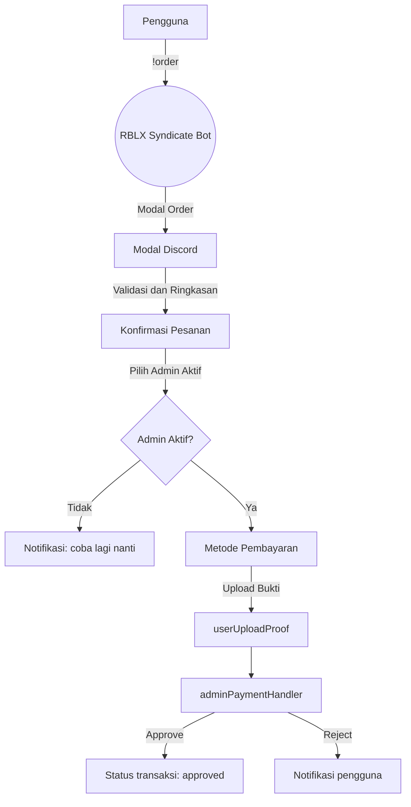

# RBLX Syndicate Bot

[](#) [](#) [](#)

> Bot Discord modern untuk mengelola pesanan, pembayaran, dan layanan midman komunitas RBLX Syndicate.

---

## Daftar Isi
- [RBLX Syndicate Bot](#rblx-syndicate-bot)
  - [Daftar Isi](#daftar-isi)
  - [Apa itu RBLX Syndicate Bot?](#apa-itu-rblx-syndicate-bot)
  - [Fitur Utama](#fitur-utama)
  - [Tech Stack](#tech-stack)
  - [Mulai Cepat](#mulai-cepat)
    - [1. Prasyarat](#1-prasyarat)
    - [2. Instalasi](#2-instalasi)
    - [3. Konfigurasi Awal](#3-konfigurasi-awal)
    - [4. Jalankan Bot](#4-jalankan-bot)
  - [Konfigurasi](#konfigurasi)
  - [Referensi Perintah](#referensi-perintah)
  - [Alur Order](#alur-order)
  - [Admin dan Midman Flow](#admin-dan-midman-flow)
  - [Struktur Direktori](#struktur-direktori)
  - [Data dan Penyimpanan](#data-dan-penyimpanan)
  - [Checklist Pengujian Manual](#checklist-pengujian-manual)
  - [Kontribusi dan Pengembangan](#kontribusi-dan-pengembangan)
  - [Lisensi](#lisensi)

## Apa itu RBLX Syndicate Bot?
RBLX Syndicate Bot adalah bot Discord berbasis `discord.js` yang mengotomatiskan proses jual beli, mulai dari katalog produk hingga konfirmasi pembayaran dan pelacakan transaksi. Bot ini dirancang spesifik untuk ekosistem Roblox RBLX Syndicate namun tetap fleksibel untuk dikembangkan lebih lanjut.

## Fitur Utama
- Order flow interaktif dengan modal Discord dan validasi stok.
- Sistem pemilihan admin aktif dan metode pembayaran yang dinamis.
- Pelacakan status transaksi lengkap dengan riwayat dan ringkasan.
- Layanan midman otomatis termasuk request form, pembuatan kanal, dan approval flow.
- Utilitas admin untuk toggle keaktifan, pembaruan stok, serta konfirmasi pembayaran.
- Persistensi data berbasis JSON yang mudah dibaca dan disinkronkan.

## Tech Stack
- Node.js 18 atau lebih baru.
- discord.js v14 (intents, modal, tombol, dan embeds).
- Penyimpanan file JSON lokal pada direktori `data/`.

## Mulai Cepat
### 1. Prasyarat
- Node.js versi 18 ke atas.
- Akses ke aplikasi Discord Bot dan token resmi.
- Hak manage server pada guild target.

### 2. Instalasi
```bash
npm install
```

### 3. Konfigurasi Awal
1. Salin file `config.json` menjadi `config.local.json` untuk pengembangan, atau buat file baru mengikuti contoh di bawah.
2. Simpan perubahan konfigurasi Anda ke file lokal dan hindari commit token rahasia.

### 4. Jalankan Bot
```bash
npm start
```
Bot akan menampilkan status pada terminal ketika sudah tersambung: "Bot aktif sebagai <username>".

## Konfigurasi
Struktur `config.json`:
```json
{
  "token": "DISCORD_BOT_TOKEN",
  "adminChannelId": "ID_CHANNEL_ADMIN",
  "privateServerLink": "LINK_PRIVATE_SERVER",
  "payments": {
    "QRIS": { "type": "image", "value": "https://..." },
    "DANA": { "type": "text", "value": "08xxxxxxxxxx an Nama" },
    "OVO": { "type": "text", "value": "08xxxxxxxxxx an Nama" },
    "GOJEK": { "type": "text", "value": "08xxxxxxxxxx an Nama" }
  }
}
```
Catatan keamanan: Token Discord bersifat rahasia. Simpan di environment variable (misalnya `DISCORD_TOKEN`) dan muat ke aplikasi bila ingin menghindari hardcode.

## Referensi Perintah
| Perintah | Deskripsi Singkat | File Utama |
| --- | --- | --- |
| `!pricelist` | Menampilkan daftar harga dan stok | `commands/pricelist.js` |
| `!order [kategori]` | Memulai flow pemesanan dengan modal | `commands/order.js`, `utils/handleOrderModal.js` |
| `!editstock` | Memodifikasi stok item tertentu | `commands/editstock.js`, `utils/updateStock.js` |
| `!addstock` | Menambahkan stok baru ke katalog | `commands/addstock.js` |
| `!admin` | Menu utilitas admin (toggle, pembayaran, dan lain-lain) | `commands/admin.js`, `utils/handleAdminSelection.js` |
| `!status` | Menampilkan riwayat transaksi pribadi | `commands/status.js` |
| `!midman` | Request layanan midman dengan validasi admin aktif | `commands/midman.js`, `utils/handleMidmanModal.js` |
| `!midmanstatus` | (Opsional) Cek status layanan midman | `commands/midmanstatus.js` |

## Alur Order


## Admin dan Midman Flow
- Admin toggle keaktifan melalui menu interaktif (`utils/adminHelper.js`).
- Midman request dibuat via modal, lalu diverifikasi (`utils/handleMidmanModal.js`).
- Approval dan completion midman tercatat di `utils/handleMidmanApproval.js` serta `utils/handleMidmanCompletion.js`.
- Pembayaran pengguna diproses melalui `utils/selectPayment.js`, `utils/userUploadProof.js`, dan `utils/adminPaymentHandler.js`.

## Struktur Direktori
```text
.
+-- index.js                 Entry point dan router event Discord
+-- config.json              Konfigurasi bot (token, kanal, metode bayar)
+-- commands/                Kumpulan command berbasis prefix
|   +-- order.js
|   +-- admin.js
|   +-- addstock.js
|   +-- editstock.js
|   +-- pricelist.js
|   +-- status.js
|   +-- midman*.js
+-- utils/                   Handler lanjutan dan helper modular
|   +-- handleOrderModal.js
|   +-- selectPayment.js
|   +-- userUploadProof.js
|   +-- adminPaymentHandler.js
|   +-- adminHelper.js
|   +-- handlePaymentChoice.js
|   +-- (lainnya)
+-- data/                    Persistensi data runtime
|   +-- items.json
|   +-- transactions.json
|   +-- adminStatus.json
|   +-- midman_requests.json
+-- package.json             Metadata project dan script npm
```

## Data dan Penyimpanan
- `data/items.json`: katalog item per kategori beserta stok.
- `data/transactions.json`: catatan transaksi pengguna, status, metode bayar, dan timestamp.
- `data/adminStatus.json`: daftar admin aktif beserta preferensi metode pembayaran.
- `data/midman_requests.json`: riwayat permintaan midman dan status masing-masing.

Backup, enkripsi, atau pindahkan file ini ke storage terkontrol bila dijalankan di server produksi.

## Checklist Pengujian Manual
- Jalankan `!order` tanpa argumen, pastikan embed kategori tampil.
- Lakukan `!order <kategori>` dan selesaikan flow hingga DM pembayaran.
- Upload bukti pembayaran dan verifikasi admin menerima notifikasi.
- Toggle admin aktif atau tidak aktif via menu admin dan cek dampaknya di flow pembayaran.
- Uji `!midman` ketika tidak ada admin aktif (harus menolak dengan pesan informatif).
- Pastikan `!status` menampilkan riwayat terbaru setelah transaksi diselesaikan.

## Kontribusi dan Pengembangan
1. Fork dan buat branch fitur baru.
2. Tambahkan dokumentasi perubahan terutama jika menyentuh flow pembayaran atau midman.
3. Sampaikan pull request beserta deskripsi skenario pengujian yang dijalankan.

Ide roadmap:
- Migrasi konfigurasi sensitif ke `.env` dengan `dotenv`.
- Tambahkan otomatisasi notifikasi ke role admin tertentu.
- Buat test suite ringan untuk validasi parser dan state transaksi.

## Lisensi
Lisensi belum ditentukan. Hubungi pemilik repositori sebelum mendistribusikan ulang kode ini.
